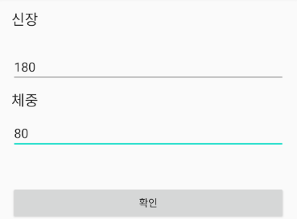

# xml  
## activity_main  
+ 체중과 신장을 입력받기 위한 EditText
+ ResultActivity로 이동하기 위한 Button  
## activity_result  
+ 중앙에 배치시키기 위해서 LinearLayout의 gravity 속성을 center로 줌  
+ 결과를 출력해 줄 TextView  
 
# Activity  
## MainActivity  
+ 두 개의 EditText를 활용해서 입력 받음  
+ EditText가 비어있을 때는 제대로 된 처리를 할 수 없으므로 Empty에 대한 처리를 따로 해주고 Button을 클릭했을 때 호출했던 setOnClickListener를 리턴시킴  
+ 올바른 입력이 들어온다면 ResultActivity를 실행시키기 위해 Intent를 통해 ResultActivity리 이동  
  - 다음 액티비티로 값을 넘겨주기 위해 putExtra를 사용할 수 있고 startActivity를 통해 intent를 실행시켜줄 수 있음  
 
## ResultActivity  
+ MainActivity에서 putExtra를 통해 넘어온 값을 Intent를 따로 선언해 줄 필요 없이 intent.get자료형Extra를 통해 사용할 수 있음   

 
