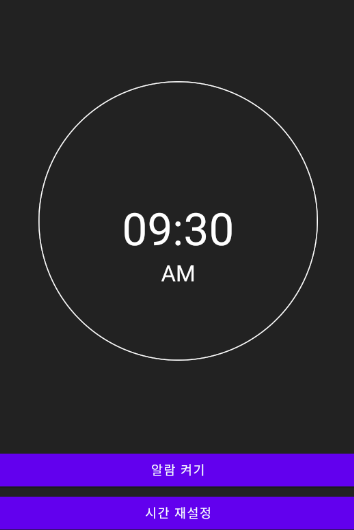

# 알람  
## xml  
### activity_main   
+ 알람과 비슷한 UI를 구성하기 위해 View를 구성해 View의 속성인 background에 drawable로 그려넣은 원을 넣어줌  
+ 시간이 나올 수 있도록 View위에 TextView 배치  
+ 해당 시간의 알람을 키는 기능과 알람을 재설정하기 위한 버튼을 배치  

## Activity  
### MainActivity  
+ 안드로이드에서의 tag 프로퍼티를 통해 모든 뷰에는 개발자 임의의 데이터를 저장할 수 있고 Object타입으로 캐스팅 되기 때문에 모든 데이터를 저장할 수 있음  
+ shardPreferences를 통해 간단한게 데이터를 저장하고 불러올 수 있도록 해줌  
+ PendingIntent 사용  
    - Notification으로 작업을 수행할 때 인텐트가 실행되도록 함  
    - Notification은 안드로이드 시스템의 NotificationManager가 Intent를 실행하고, 즉 다른 프로세스에서 수행하기 때문에 Notification으로 Intent수행 시 PendingIntent의 사용이 필수  
    - AlarmManager를 통해 지정된 시간에 인텐트가 시작되도록 할 때 PendingIntent를 사용함  
    - 컴포넌트의 유형에 따라 생성자 메서드를 호출하는 방법이 다르기 때문에 컴포넌트에 맞게 PendingIntent객체를 생성해줘야 함  
+ BroadcastReceiver 사용  
    - 브로드캐스트 리시버는 안드로이드 4대 컴포넌트 중 하나로 디바이스 상태를 사용자가 수신받을 수 있음  
    - BroadcastReceiver클래스를 상속한 Receiver 클래스에서 onReceive 메서드를 오버라이드해서 수신했을 때 어떤 액션을 취할지를 명시해줌  
 
 

  
