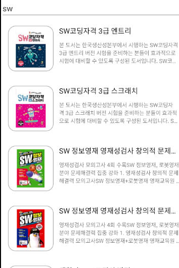
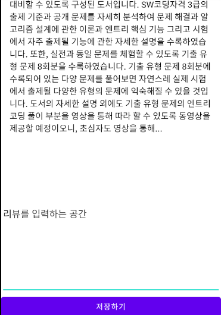

# 도서 리뷰    
## xml  
### activity_main   
+ 도서를 검색하기 위한 EditText  
+ 검색한 도서의 정보를 보여주기 위한 View가 필요하고 책이 많아질 수 있기 때문에 효율적으로 관리하기 위한 RecyclerView사용  
+ 검색한 정보의 기록도 추가로 관리해주기 위해서 RecyclerView를 추가로 구성   

### activity_detail  
+ 원하는 도서를 클릭했을 때 더 자세한 정보를 보여주는 Activity를 구성  
+ 자세한 정보를 담아줄 Text,Image View 등으로 구성되어 있고 리뷰를 남길 수 있도록 EditText도 추가로 구성   
## Activity  
### MainActivity  
+ Room을 활용해 database관리  
+ Retrofit 활용  
    - 안드로이드에서 쉽게 Restful한 통신을 할 수 있도록 도와주는 라이브러리로 호출이나 비동기 처리 등 이용이 손쉽고 속도도 빠름, 즉 개발자들이 더 쉬운 네트워크 통신을 하기 위해서 Retrofit 사용  
    - API를 호출하게 되면 enqueue로 동작하게 되고 실제 메인 UI쓰레드에서 동작할 수 없기 때문에 비동기로 동작함  
    - enqueue라는 메소드는 callback을 기대하게 되고, callback은 서버로부터 response될 때마다 실행되게 됨  
    - override 해야 하는 onResponse를 통해서 response의 body()를 통해 값을 가져올 수 있음  
+ API 인터페이스를 생성해주고 GET방식으로 값을 받아오겠다는 것을 어노테이션으로 명시해 주고 Query부분에 실제로 함수를 호출할 때 필요한 파라미터로 값을 전달해 줌  
+ data class를 만들 때 응답과 다르게 변수명을 정해주고 싶을 경우 @SerializedName 어노테이션을 사옹해서 괄호 안에 응답과 동일하게 써주고 변수명을 다르게 지정해주면 됨  
+ RecyclerView의 성능을 향상 시키기 위해 Diffutil을 활용
    - DiffUtil은 현재 데이터 리스트와 교초될 데이터 리스트를 비교하여 바뀌어야 할 데이터만 바꿔줌으로써 Adapter에서 사용한 notifyDataSetChanged()에서 리스트를 모두 바꿧던 것보다 훨씬 빠른시간 내에 데이터를 교환할 수 있음   
+ RecyclerView는 ClickListener가 내장되어 있지 않으므로 onClickListener를 통해 직접 구현해주어야 함  
+ RecyclerView에서는 ViewHolder패턴을 강제로 구현하게 해서 뷰바인딩을 한번만 해주고 이후 아이템을 생성할 떄는 바인딩 된 뷰 객체를 재활용하는 장점이 있음    
 

  

