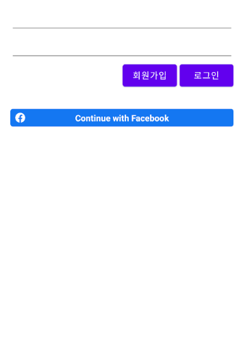
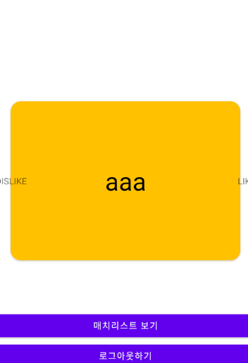

# 친구 매칭      
## xml  
### activity_main   
+ 로그인의 여부만 판단해서 다른 액티비티로 넘겨주는 것만 담당  
### activity_login  
+ 로그인을 하는 창으로 입력을 할 EditText가 있고 회원가입과 로그인을 하기 위한 Button이 있음  
+ 페이스북의 정보를 가져와 로그인 해주기 위해 Facebook의 버튼을 추가로 만들어 줌  
### activity_match  
+ match된 상대방의 list를 가지고 있기 위해서 RecyclerView 배치  
### activity_like  
+ 존재하는 리스트의 친구를 like와 dislike로 분류하는 것을 진행하기 위해 있는 뷰로 로그인이 되어있다면 이곳으로 이동  
+ 매치, 로그아웃 등을 하기 위한 버튼이 존재  
+ 친구들의 리스트를 아이디 값이 쌓여있는 형태로 보여지게 하기 위해 오픈 소스인 CardStackView 사용  
## Activity  
### MainActivity  
+ onStart()를 override하고 파이어베이스의 auth를 사용하기 전 인스턴스를 받아오고 해당 instance의 currentUser가 null이면 LoginActivity로 이동하게 해주고 null이 아닌 사용자라면 LikeActivity로 이동하게 해줌  
### LoginActivity  
+ 이메일과 패스워드를 입력받을 때 로그인을 할 수 있게 해주고 두 부분이 다 채워져야 로그인이나 회원가입의 버튼이 활성화 되도록 EditText의 addTextChangedListener를 통해 버튼들을 활성화/비활성화 시켜줌  
+ 회원가입 기능은 단순하게 로그인 창에서 아이디 비밀번호를 입력하는 형태로만 진행할 수 있도록 진행  
    - auth를 가져와 createUserWithEmailAndPassword를 통해 이메일과 패스워드를 통해서만 회원가입을 가능하게 했고 addOnCompleteListener를 이용해 중복되는 회원에 대해서 알림을 보여주고 그 외에는 성공 알림을 보여주게 함  
+ 로그인을 할 때는 auth의 signInWithEmailAndPassword를 통해 이메일과 패스워드를 통해서 위에서와 같이 CompleteListener를 사용해 로그인의 성공여부를 알려줌  
+ 데이터베이스에 있는 데이터를 읽거나 쓰기 위해서는 firebase.database.Reference의 인스턴스가 필요하고 해당 인스턴스에서 child를 통해 원하는 path에서 값을 읽고 쓸 수 있음  
+ 페이스북은 CallbackManager를 통해 콜백을 관리하고 로그인 요청 시에 결과를 onActivityResult() 메소드를 통해 들어오게 되고 로그인 결과를 CallbackManager로 넘겨주어 관리하도록 함  
+ 페이스북 로그인 버튼에 콜백을 등록하여 CallbackManager에 담겨진 로그인 결과를 처리해 줌  
### LikeActivity  
+ reference 객체의 child를 통해 DB를 가져오고 처음 나의 정보를 불러오기 위해 addListenerForSingleValueEvent를 사용해 즉시성으로 발휘시키고 내 정보를 불러오기 위해 딱 한번 가져오도록 함  
+ 다른 유저들이 추가될 때마다 정보를 업데이트 시켜주기 위해 연결된 객체에서 addChildEventListener를 사용해 한 번만 발휘되는게 아니라 전체 유저의 테이블에 대한 CHANGE를 확인하고 CHANGE되어 이벤트를 받았을 때 해당 이벤트에 맞는 처리를 해줌  
+ 오픈소스인 CardStackView를 사용하기 위해 필요한 method들을 override해줌  
+ 카드들이 Like와 Dislike로 swipe될 때마다 동작을 실행시켜주기 위해 override한 onCardSwiped에 db가 업데이트 될 수 있도록 작성  
+ 상대방과 내가 둘다 LIKE했다면 Match가 되었는지를 알려주어야 하기 때문에 내가 LIKE하는 시점에 상대방도 내가 LIKE되어 있다면 서로의 Match List에 보일수 있도록 db를 업데이트 해줌  
### MatchedUserActivity  
+ 매치된 유저들을 RecyclerView를 통해 보여줌  
+ 연결된 DB에 addChildEventListener를 실행시켜 child가 add될 때마다 RecyclerView를 update시켜줌   
  

