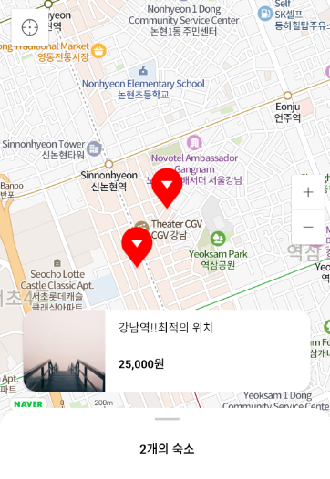

# 에어비엔비  
1.Naver Map API 사용  
2.ViewPager2 사용  
3.FrameLayout 사용  
4.CoordinatorLayout 사용  
5.BottomSheetBehavior 사용  
6.Refrofit 사용  
7.Glide 사용  
## xml  
### activity_main   
+ CoordinatorLayout을 사용해서 bottomsheet을 사용하고 싶은 레이아웃에 behavior 속성을 걸어줌  
+ bottomsheet을 구성하기 위해서는 따로 위젯은 없음  
+ bottomsheet xml을 따로 만들어주고 include를 걸어줌  
+ bottomsheet xml에서 layout의 속성에 있는 layout_behaivor에 BottomSheetBehavior를 주고 얼마 정도 보일지 기본 속성인 behavior_peekHeight를 설정해 줌  
+ bottomsheet을 구성할 위젯들을 구성해줌  

## Activity  
### MainActivity  
+ MapFragment나 MapView를 통해 지도에 대한 뷰를 얻을 수 있고 MapView를 사용할 때는 반드시 MapView가 포함된 액티비티의 라이프 사이클에 맞추어 필요한 생명주기 메소드들을 호출해주어야 하고 MapFragment를 사용하면 이러한 절차가 필요하지 않음  
+ 여기서 사용한 MapView는 지도에 대한 뷰 역할만 담당하고 API를 호출하기 위해서는 인터페이스 역할을 하는 NaverMap 객체가 필요함. MapView의 getMapAsync() 메서드로 OnMapReadyCallback을 등록하면 비동기로 NaverMap 객체를 얻을 수 있고 NaverMap객체는 오직 콜백 메서드를 통해서만 얻을 수 있음
+ NaverMap객체가 준비된다면 onMapReady() 콜백 메서드가 호출 됨  
+ Marker를 활용해 받아온 위치에 mark를 표시해 줌  
    - maker가 클릭되었을 때 이벤트를 처리해주기 위해서 Overlay.OnClickListener를 상속 받고 override해야 하는 onClick 메소드에 필요한 기능을 작성  
+ Mock API를 이용해 서버에서 정보가 내려오는 것처럼 사용하여 받아온 정보를 활용  
+ Retrofit을 사용해 mocky로 부터 응답을 받아옴  
+ viewPager를 사용해 viewPager에서 선택 된다면 registerOnPageChangeCallback을 사용해 맵의 위치로 cameraUpdate를 해줌  
+ viewPager의 아이템을 선택했을 때 Adapter에 itemClicked를 연결시켜주고 공유할 수 있도록 Intent를 실행시켜줌  
  

