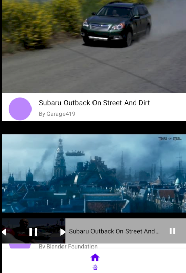
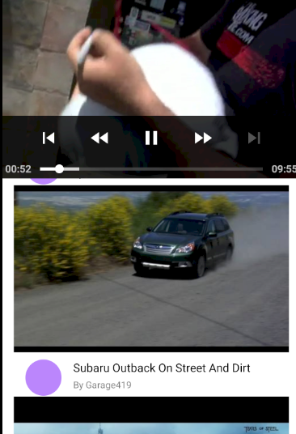

# 유투브 같은 동영상 플레이어  
## xml  
### activity_main   
화면을 Motion Layout으로 구성  
+ ConstrainLayout을 상속하는 레이아웃  
+ 기존의 애니메이션을 추가하는 방식과는 다르게 레이아웃 두개를 만든 뒤 두 레이아웃 사이의 전환효과를 정의   
+ MotionLayout의 가장 큰 특징은 애니메이션에 관련 내용을 별도의 xml로 분리하여 사용한다는 점  
+ MotionLayout을 통해 res/xml에 xml파일로 MotionScene 파일을 생성시켜 줌  
+ MotionScene은 ConstraintSet,키프레임,터치조작,화면전환 효과 등의 애니메이션 정보를 포함한 xml파일  
    - Transition: MotionScene내에서 정의되며, 화면을 어떤식으로 전환시킬지에 대한 정의를 함  
        * OnSwipe: Transition내에서 정의되며 손끝의 움직임과 화면전환을 일치 시켜주는 핸들러
        * OnClick: targetView를 클릭했을 때 어떤 화면전환 애니메이션 효과를 보여줄지 정의함  
        * KeyFrameSet: KeyFrame을 적용하면 자연스럽게 애니메이션에 커브를 적용하거나 모핑을 시도할 수 있음  
        * KeyPosition: 키프레임에서의 뷰의 위치를 지정  
        * KeyAttribute: KeyPosition과 비슷한 역할을 하지만 Position이 아닌 Attribute에 관여    
    - ConstraintSets: 레이아웃에 대한 모든 규칙을 캡슐화하여 뷰를 만들지 않고도 레이아웃에 적용할 규칙 세트를 즉석에서 결정할 수 있고, 여러개의 Constraint를 포함할 수 있음  

BottomNavigationView를 배치  
+ BottomNavigation을 구성할 item들을 res/menu의 xml에 item을 통하여 구성해줌    

동영상 목록을 구성할 RecyclerView  

프래그먼트를 담을 레이아웃 컨테이너로 FrameLayout을 사용(프래그먼트=사진, 액자=프레임 레이아웃)    
+ 액티비티는 4대 컴포넌트 중 하나이며 안드로이드 시스템에서 관리하고 관리하는 시스템의 모듈을 액티비티 매니저라고 부르고 시스템이 이해하는 형식으로 명령이나 데이터를 만들어서 보내는데 인텐트가 그 역할을 담당  
+ 프래그먼트는 동작 방식이 액티비티와 유사하지만 안드로이드 시스템이 하던 역할을 액티비티가 하게되고 액티비티 매니저 시스템 모듈 대신에 프래그먼트 매니저라는 것이 프래그먼트들을 관리하게 됨  
+ 액티비티와 프래그먼트 사이에서는 인텐트를 사용할 수 없음  
  
 ### fragment_player  
 MoitionLayout을 상속하는 CustomMotionLayout을 만들어 CustomMotionLayout을 사용해 화면을 구성  
 하단의 작은 플레이어를 구성할 ConstraintLayout을 만듦  
 + ConstriantLayout안에 Exoplayer의 PlayerView를 배치하여 작은 플레이어 구성 
 + 현재 재생여부를 나타낼 재생버튼을 구성   
 + 제목을 표시할 TextView를 구성  
 + 위의 View들을 MotionLayout의 속성을 통해 Event에 따라 배치될 방식을 지정  

ConstraintLayout의 playerView가 확대 되었을 때 RecyclerView가 보여지도록 ConstraintLayout하단에 RecyclerView를 배치  

## Activity  
### MainActivity  
Retrofit을 사용해 서버로부터 videoModel에 대한 정보를 받아오고 adapter에 submit해줌    

supportFragmentManager를 사용해 frameLayout을 playerFragment로 replace해줌  

video의 리스트로 구성된 videoAdapter들의 리스트를 클릭했을 때 fragment내의 play 함수를 실행시켜주기 위해 PlayerFragment인 fragment를 찾아서 타입을 캐스팅 시켜주고 play시켜줌  

### PlayerFragment  
Fragment를 상속하면서 인자로 xml파일을 넘겨주면서 layout을 연결시켜줌  

onViewCreated를 override  
+ onCreateView에서 inflater를 이용해 view를 불러와 view를 리턴해서 onViewCreated를 통해서 사용하도록 설계되어 있음(여기서는 onCreateView를 사용하지 않고 인자를 통해 layout을 연결시켜줌)  

SimpleExoPlayer를 build하여 player에 등록해줌  
+ player의 addListener를 통해 play가 change될 때의 event를 control 해줌   

### CustomMotionLayout  
Motion Layout을 상속받아 특정 Event에 대한 처리를 해주는 class  

Fragment가 View를 차지하게 되어 작은 플레이어가 메인엑티비티의 하단을 구성했을 때 뒤의 RecyclerView가 클릭이 되지 않는 현상을 처리해줌  

  

