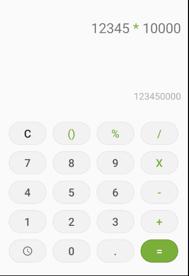
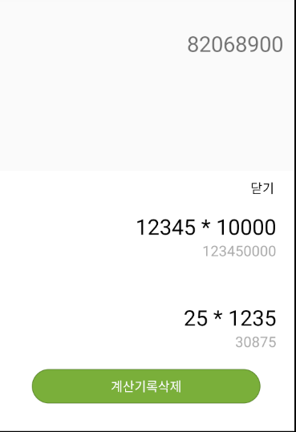

# 계산기  
## xml  
### activity_main  
+ 텍스트가 입출력되는 부분과 버튼 부분의 View를 정해진 비율로 나눠주기 위해서 상단의 텍스트가 입출력되는 부분을 View로 감싸줌  
+ 계산기의 버튼 부분은 TableLayout을통해 감싸 동일한 weight를 가지고 버튼이 위치할 수 있도록 설정  
+ 동일한 기능을 가지는 버튼이 많기 때문에 MainActivity에서 모두 연결시켜주기보다는 onClick속성을 통해서 해당 함수를 실행시켜주는 형태로 실행  
+ 계산결과를 기록에 남겨주기 위해 같은 화면에 ConstraintLayout을 추가하고 초기상태를 위해 visibility를 gone으로 설정  
+ 해당 Layout에 기록들이 scroll형태로 보여지기 위해 ScrollView를 추가해주고 ScrollView안에 아이템들이 추가될 때마다 해당 view를 추가해주기 위해 내부에 layout형태로 작성  
  - 추가되는 view를 해당 layout에 추가해주기 위해 해당 layout을 구성할 layout파일을 추가로 만들어주어야 함  

## Activity  
### MainActivity  
+ 계산기록을 가지고 있기 위해 RoomDatabase()를 활용 
  - Room을 구성하기 위해 Entity, DAO, Roomdatabse를 extend할 추상 클래스가 필요    
+ Room.databaseBuilder를 호출해 새로운 db객체를 만들어 줌  
  - 메인스레드에서 Room DB에 접근하려고하면 에러가 발생하므로 Room과 관련된 액션은 Thread등을 이용해서 백그라운드에서 작업해야 함  
  - Thread에서 UI에 접근하기 위해서는 runOnUiThread를 통해서 접근해주어야 하고 따라서 text를 변경하거나 view를 추가하는 작업을 진행해 주어야할 때는 runInUiThread 내부에서 처리해 주어야 함  
+ xml과 연결된 버튼의 onClick에 대한 함수들을 처리해 줌   
+ SpannableStringBuilder를 사용해 코드상으로 TextView에 넣을 문자 일부의 색,크기,스타일 등을 변경할 수 있음   

 
